## **Asset Allocation Model**

I created this model for a personal purpose, but feel free to use it if useful.

The asset allocation model consists of using libraries and APIs such as YahooFinance, GoogleFinance and also Brazilian Central Bank open data.

As soon as a Start and End Date is defined (01-01-2013 -> 20-10-2023 in the examples), price history data is calculated for 4 traditional asset classes, represented by indices:

**1- Emerging Market Equities** (IBOV), **2- Developed Economy Equities** (IVV, which represents the S&P500 + the USD/BRL exchange rate variation), **3- Real Estate** (IFIX) and **4- Fixed Income** (CDI, also considered a "risk-free rate" for the study).

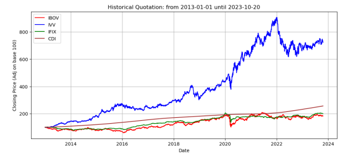

In addition to the historical variation plot, the Average Returns, Standard Deviation, and also the Covariance between the 4 asset classes are calculated.

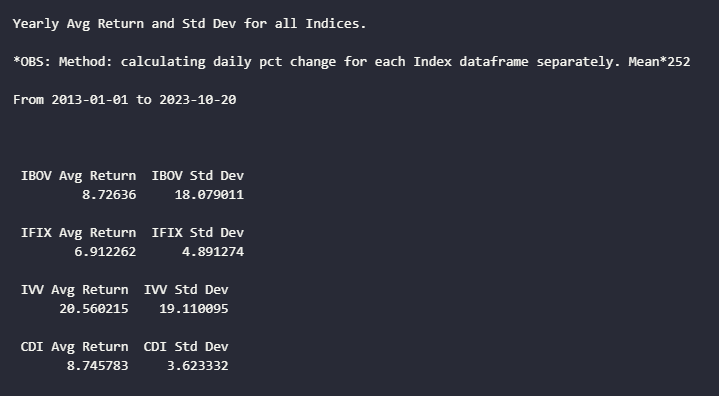
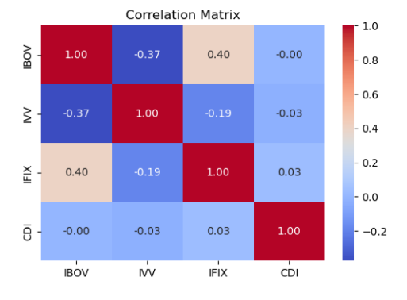

Given the assets characteristics, a N number of simulations are randomly executed (6000 in the example) changing portfolio weights and positioning return and risk on a scatter chart:

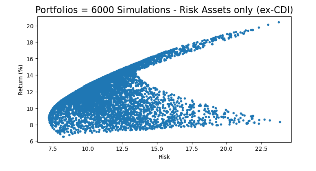

Given these portfolios, it is possible to know the optimized allocation (weights) to produce a specific result, the Minimum Risk Portfolio for example:

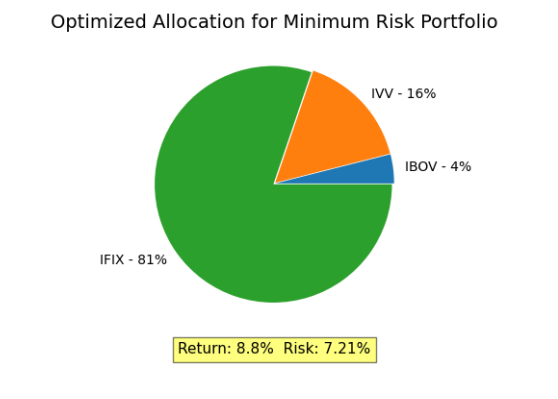
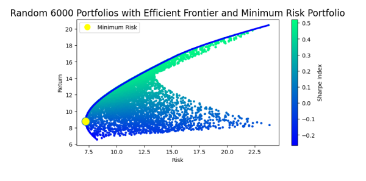

The optimized allocation for a Maximum Sharpe portfolio would be:

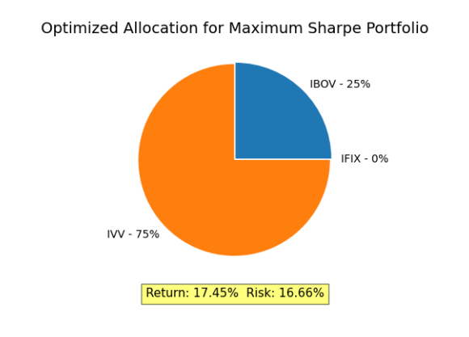
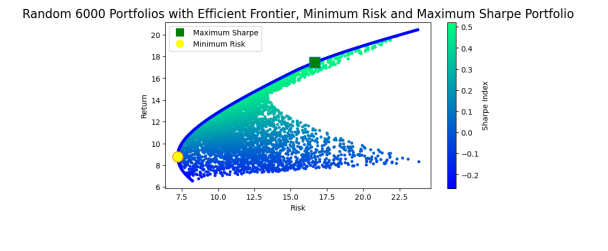

All the portfolio simulations so far considers CDI (fixed income) a Risk-Free rate, so it was removed from covariance model. Now we add CDI as Risk-Free Rate on portfolios chart, making it Complete on a capital allocation line point of view: (risk 0 although it has a little bit higher standard deviation returns, let's say, 2%)

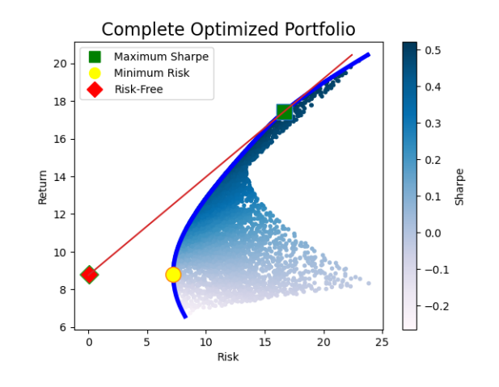

After that, I've included a feature in which you can simulate a portfolio (Your Portfolio) and check it's expected return and expected risk. Given your input weights for each asset class, the covariance matrix is considered on pondering it for each Average Return and Standard Deviation statistics. In my example, I've set the string '[0.35, 0.15, 0.25, 0.25]', that is:

- 35% IBOV
- 15% IVV
- 25% IFIX
- 25% CDI

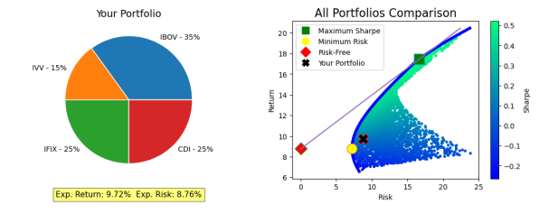

This is my custom portfolio Expected Return and Expected Risk. Considering the results a normal and symmetrical distribution, here are more N (1000 in the example) simulations and distribution on return and risk for the same custom portfolio weights.

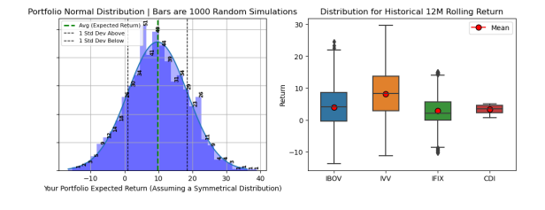

You can note in the scatterplot that my portfolio position is not touching Efficient Frontier Line. And for all portfolios, there is 2 ways to boost results optimizing the allocation weights: 1- Maintaining the same Risk Level and enhancing Return Level, so the function shows the optimized allocation:

And also there is the option of 2- Achieving a lower Risk Level for the same Return:

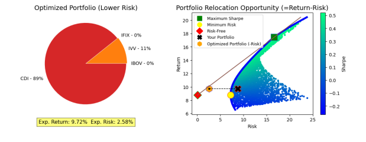

OBS: It is important to make some reservations:
- Nothing here is an investment recommendation
- Make sure you understand the model limitations
- I've set 2013 mainly because this is the oldest data for IFIX. Maybe it is prudent in any time to consider another index for Real Estate. IFIX Data is on a excel spreadsheet on repo. I didn't found IFIX data in YahooFinance so I used GoogleFinance/GoogleSheets.
- These years were particularly bad for Brazil, so keep in mind that it have impact on Risk-Free (fixed income). Try different date frames on filtering Start Date and End Date.

